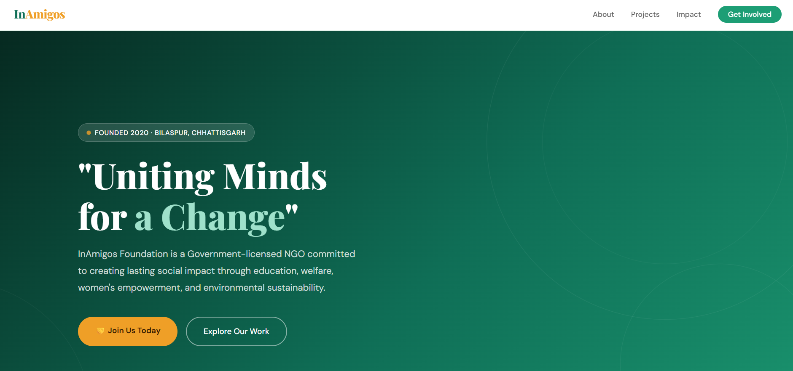
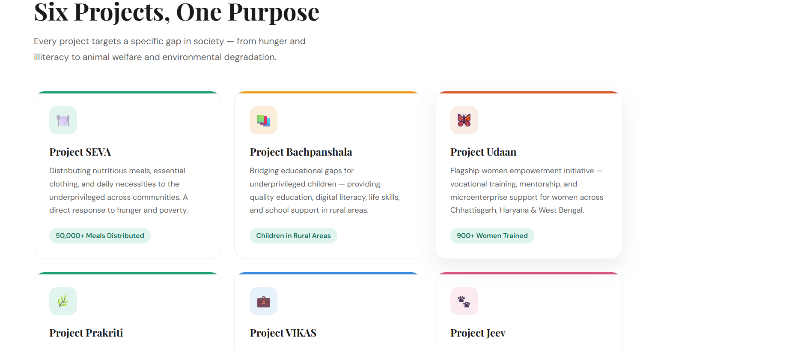
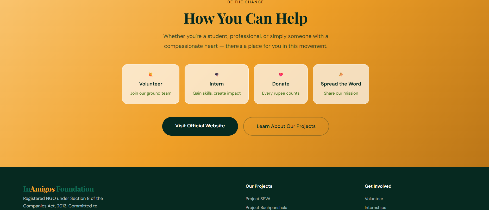

# InAmigos Foundation — NGO Awareness Webpage

> "Uniting Minds for a Change"

This is a static awareness webpage created for **InAmigos Foundation**, a registered NGO based in Bilaspur, Chhattisgarh. The webpage was built as part of an internship task to spread awareness about the foundation's projects and initiatives.

---

## 🌐 Live Demo

🔗 (https://in-amigos-ngo-webpage-xi.vercel.app/) <!-- Replace with your Vercel link -->

---

## 📌 About InAmigos Foundation

InAmigos Foundation is a Government-licensed NGO founded on **September 23, 2020** by **Mr. Govind Shukla**. It is registered under Section 8 of the Companies Act, 2013 and operates across multiple Indian states with a mission to create lasting social impact.

**Certifications:**
- ✅ Section 8 — Licensed by Central Government
- ✅ 80G & 12A Certified
- ✅ CSR-1 Registered
- ✅ NITI Aayog Registered
- ✅ IAF ISO 9001:2015 Certified

---

## 📋 Sections Covered

| Section | Description |
|---|---|
| Hero | Tagline, key stats, call-to-action buttons |
| About | Foundation history, founder info, certifications |
| Projects | All 6 flagship projects with details |
| Impact | Real numbers and achievements |
| Focus Areas | 8 cause areas InAmigos works on |
| Get Involved | Volunteer, Intern, Donate, Spread the word |
| Footer | Project links, hashtags |

---

## 🚀 Projects Featured

1. **Project SEVA** — Food & clothing distribution (50,000+ meals)
2. **Project Bachpanshala** — Education for underprivileged children
3. **Project Udaan** — Women empowerment (900+ women trained)
4. **Project Prakriti** — Environmental sustainability
5. **Project VIKAS** — Skill development & internships (30,000+ interns)
6. **Project Jeev** — Animal welfare

---

## 💻 Technologies Used

- HTML5
- CSS3
- Vanilla JavaScript (scroll animation only)

---

## 📁 Folder Structure

```
inAmigos-ngo-webpage/
│
├── index.html       → Main HTML file
├── style.css        → Stylesheet

```

---

## ▶️ How to Run Locally

1. Clone or download this repository
2. Make sure `index.html` and `style.css` are in the **same folder**
3. Open `index.html` in any browser

No installations or dependencies needed!

---

## 📸 Screenshots

### About Section


### Projects Section


### Footer Section


---

## 🙋 Author

Made with ❤️ as part of the **InAmigos Foundation Web Development Internship**

**Hashtags:** `#InAmigos` `#IAF` `#IAFForChange` `#IAFImpact` `#UnitingMindsForAChange`